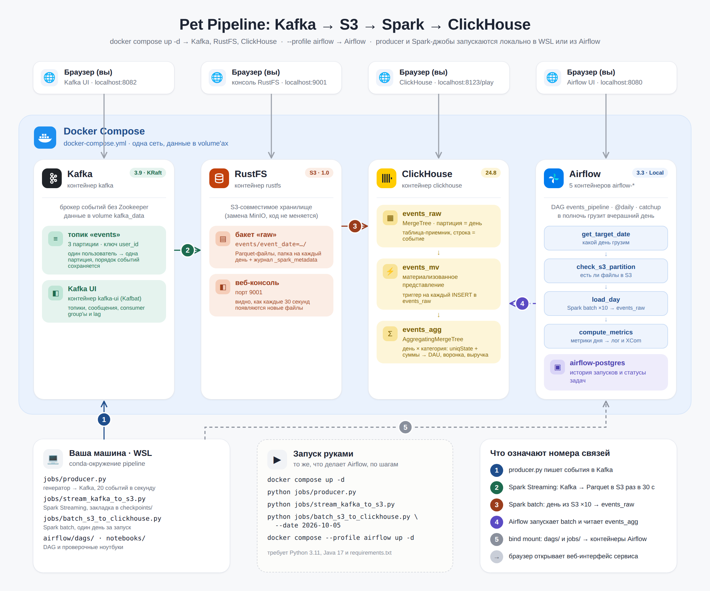

# Pet Pipeline: Kafka → S3 → Spark → ClickHouse

Учебный пайплайн данных: позволяет увидеть, как событие проходит путь 
через брокер сообщений, объектное хранилище, стриминг и батч на Spark,
аналитическую базу и оркестратор

## Архитектура

```text
producer.py (генератор событий)
       ↓
Kafka, топик events
       ↓
Spark Structured Streaming  ← раз в 30 секунд
       ↓
S3 (RustFS), Parquet по дням
       ↓
Spark batch  ← один день за запуск, ×10
       ↓
ClickHouse: events_raw → events_mv → events_agg
       ↓
  метрики

Загрузку дней и расчет метрик оркестрирует Airflow.
```



## Что здесь можно увидеть

- **Как Kafka раскладывает сообщения по партициям.** В Kafka UI видно, что
  события одного пользователя всегда лежат в одной партиции: ключ
  сообщения — `user_id`.
- **Как работает стриминг.** В консоли S3 каждые 30 секунд появляются
  новые Parquet-файлы, а в Spark UI на вкладке Structured Streaming —
  графики входящих и обработанных записей. Если остановить стрим и
  запустить снова, он продолжит с того же места: закладка лежит в checkpoint.
- **Что материализованное представление в ClickHouse — это триггер.**
  Вставляете строки в `events_raw` — агрегаты сами появляются в `events_agg`.
- **Почему уникальных пользователей нельзя складывать.** Запрос
  «DAU как сумма по категориям» дает больше, чем DAU на самом деле;
  правильный ответ дают состояния `uniqState` / `uniqMerge` (см. раздел
  «Посмотреть, как это работает»).
- **Идемпотентность.** Загрузку одного дня можно перезапускать сколько
  угодно раз — число строк в ClickHouse не меняется.
- **Регулярный процесс в Airflow.** Включаете DAG — Airflow сам
  догоняет пропущенные дни (catchup) и обрабатывает каждый отдельным
  запуском, а при сбое повторяет задачу.
- **Что данные дошли без искажений.** Генератор задает веса событий
  70 / 20 / 10 % и цены от 100 до 5000 — в метриках на выходе видны
  те же закономерности.

## Модель данных

Одно событие — одно действие пользователя:

| Поле | Тип | Пример |
|---|---|---|
| `event_id` | UUID | `5f1c…` |
| `user_id` | целое | `10423` |
| `product_id` | целое | `877` |
| `category` | строка | `electronics` |
| `price` | Decimal(10,2) | `1299.00` |
| `event_type` | строка | `view`, `add_to_cart`, `purchase` |
| `event_ts` | DateTime | `2026-10-05 14:32:10` |

Объекты в ClickHouse:

| Объект | Движок | Роль |
|---|---|---|
| `events_raw` | MergeTree, партиция = день | таблица-приемник, сюда пишет Spark |
| `events_mv` | Materialized View | на каждую вставку в `events_raw` считает агрегаты |
| `events_agg` | AggregatingMergeTree | день × категория: уникальные пользователи и покупатели, счетчики, выручка |

## Структура проекта

```text
jobs/           # Python- и Spark-джобы: генератор, producer, стриминг, батч
clickhouse/     # схема ClickHouse и запросы метрик
airflow/        # Dockerfile образа Airflow и DAG
notebooks/      # проверочные ноутбуки
docs/           # схема архитектуры
```

## Требования

- Windows + WSL2 / macOS / Linux
- Docker Desktop (Windows/macOS) или Docker Engine + Compose (Linux),
  для Docker не меньше 10 ГБ памяти (на WSL2 — `memory=12GB` в `.wslconfig`)
- Python 3.11 (например, через conda) и Java 17 — для локального Spark
- Git

## Запуск

**1. Клонировать репозиторий:**

```bash
git clone https://github.com/phineaeas/pet-pipeline.git
cd pet-pipeline
```

**2. Создать Python-окружение:**

```bash
conda create -n pipeline python=3.11 -y
conda activate pipeline
pip install -r requirements.txt
```

**3. Настроить пароли.** Скопировать шаблон и вписать в `.env` пароли
для `S3_SECRET_KEY` (не короче 8 символов) и `CLICKHOUSE_PASSWORD` —
латиница и цифры, без пробелов, кавычек, `$` и `#`:

```bash
cp .env.example .env
```

**4. Поднять сервисы:**

```bash
docker compose up -d
docker compose ps
```

Должны работать четыре контейнера: `kafka`, `kafka-ui`, `rustfs`,
`clickhouse`. У `kafka` через минуту статус станет `healthy`.

**5. Создать топик Kafka:**

```bash
docker exec kafka /opt/kafka/bin/kafka-topics.sh --bootstrap-server localhost:9092 \
  --create --topic events --partitions 3 --replication-factor 1
```

**6. Проверить связку и создать бакет.** Открыть
`notebooks/01_smoke_test.ipynb`, выбрать ядро `pipeline` и выполнить
ячейки по очереди. Ноутбук создает бакет `raw` в S3 и проверяет, что
Python и Spark видят Kafka, S3 и ClickHouse. Первый запуск Spark
скачивает jar-пакеты (около 300 МБ) — несколько минут.

**7. Создать таблицы ClickHouse:**

```bash
docker exec -i clickhouse bash -c 'clickhouse-client --user "$CLICKHOUSE_USER" --password "$CLICKHOUSE_PASSWORD" --multiquery' < clickhouse/01_schema.sql
```

**8. Запустить поток событий** — в двух терминалах:

```bash
python jobs/producer.py                 # 20 событий в секунду в топик events
python jobs/stream_kafka_to_s3.py       # Kafka → S3 раз в 30 секунд
```

Через минуту в S3 появятся первые файлы. Генератор раскидывает события
по последним трем дням, так что сразу будет несколько дат.

**9. Поднять Airflow:**

```bash
docker compose --profile airflow up -d --build
```

Первая сборка образа занимает 5–10 минут: в него ставятся Java и PySpark.

## Доступ к сервисам

**Kafka UI** — http://localhost:8082
Логин не нужен.

1. **Topics → `events`** — список топиков; у `events` 3 партиции.
2. Вкладка **Overview** — сколько сообщений в каждой партиции.
3. Вкладка **Messages** — сами события: колонки Partition, Offset,
   Key (это `user_id`) и Value (JSON события). Найдите одинаковый ключ
   дважды — он окажется в той же партиции.

**Консоль S3 (RustFS)** — http://localhost:9001
Логин и пароль — `S3_ACCESS_KEY` и `S3_SECRET_KEY` из `.env`.

1. Бакет **`raw` → `events`** — папки `event_date=…`, по одной на день.
2. Откройте папку дня и обновите страницу через 30 секунд — пока стрим
   работает, появляются новые Parquet-файлы.

**Spark UI** — http://localhost:4040 (пока работает `stream_kafka_to_s3.py`)

1. Вкладка **Structured Streaming** → ваш стрим — графики: сколько записей
   приходит в секунду и сколько обрабатывается.

**ClickHouse** — http://localhost:8123/play
Пользователь `pipeline`, пароль — `CLICKHOUSE_PASSWORD` из `.env`
(поля справа вверху). Запросы выполняются **по одному**: вставьте один
запрос и нажмите Run. Готовые запросы метрик — в `clickhouse/02_metrics.sql`.

**Airflow** — http://localhost:8080
Логин не нужен: на учебном стенде все входят как администраторы.

1. **Dag-и → `events_pipeline`** — DAG создается на паузе.
2. Включите **переключатель** рядом с названием — Airflow создаст запуски
   за пропущенные дни и выполнит их по очереди, по одному.
3. Вид **Grid** (кнопка с квадратиками слева вверху) — столбик на каждый
   запуск, квадратик на каждую задачу: зеленый — успех, красный — ошибка,
   желтый — ждет повтора, розовый — пропущена (за день нет данных).
4. Нажмите на квадратик **`load_day`** → **Логи** — вывод Spark-джобы,
   в конце `Готово, всё сошлось.`
5. Квадратик **`compute_metrics`** → **Логи** или **XCom** — метрики дня.
6. Кнопка **Запустить** справа вверху — ручной запуск: обработает вчерашний день.

## Пайплайн

```text
get_target_date
   ↓
check_s3_partition
   ↓
load_day
   ↓
compute_metrics
```

DAG `events_pipeline` запускается каждый день в полночь (UTC) и
обрабатывает **вчерашний** день — он уже закончился, все события
за него собраны. Время в интерфейсе показывается в вашем часовом поясе
(для Москвы полночь UTC — это 03:00).

- `get_target_date` — вычисляет дату дня;
- `check_s3_partition` — проверяет, что в S3 есть файлы за этот день,
  иначе пропускает запуск;
- `load_day` — запускает `jobs/batch_s3_to_clickhouse.py`: размножает
  день ×10, удаляет его в ClickHouse, записывает заново и сверяет число
  строк; при несовпадении задача падает;
- `compute_metrics` — считает DAU, воронку, выручку и средний чек.

При падении задача повторяется один раз через минуту.

## Посмотреть, как это работает

**Загрузка дня без Airflow.** То же, что делает задача `load_day`:

```bash
python jobs/batch_s3_to_clickhouse.py --date 2026-10-05
```

Запустите дважды — в ClickHouse не появится дублей:

```sql
SELECT event_date, count() FROM pipeline.events_raw GROUP BY event_date ORDER BY event_date
```

**Почему DAU нельзя складывать по категориям.** Сумма уникальных
пользователей по категориям больше реального DAU — один человек смотрит
несколько категорий:

```sql
SELECT sum(u) AS wrong_dau
FROM (SELECT category, uniqMerge(users) AS u
      FROM pipeline.events_agg WHERE event_date = '2026-10-05' GROUP BY category)
```

```sql
SELECT uniqMerge(users) AS dau
FROM pipeline.events_agg WHERE event_date = '2026-10-05'
```

**Стрим не теряет и не дублирует события.** Остановите
`stream_kafka_to_s3.py` (Ctrl+C), подождите минуту и запустите снова —
он заберет всё накопившееся. Ноутбук `notebooks/02_raw_events.ipynb`
покажет число дублей — 0.

**Airflow сам повторяет упавшую задачу.** Остановите ClickHouse,
нажмите **Запустить** в Airflow, дождитесь желтого `load_day` и верните
ClickHouse — через минуту задача станет зеленой:

```bash
docker compose stop clickhouse
docker compose start clickhouse
```

**Метрики.** Запросы из `clickhouse/02_metrics.sql` в ClickHouse Play.
Ожидаемо: конверсия просмотр → корзина около 29 %, корзина → покупка
около 50 %, средний чек около 2550, а в сверке `events_raw` и
`events_agg` везде `ok = 1`.

## Сервисы

| Сервис | Назначение | Адрес |
|---|---|---|
| Kafka | брокер событий | `localhost:9094` |
| Kafka UI (Kafbat) | просмотр топиков и сообщений | http://localhost:8082 |
| RustFS | S3-хранилище сырых данных | API `localhost:9000`, консоль http://localhost:9001 |
| Spark (PySpark 3.5) | стриминг и батч, local-режим | Spark UI http://localhost:4040 |
| ClickHouse | аналитическая база и метрики | http://localhost:8123/play |
| Airflow 3.3 | оркестрация | http://localhost:8080 |

## Ключевые решения

- **RustFS вместо MinIO** — MinIO перестал публиковать бесплатные
  Docker-образы; протокол тот же S3, код не меняется.
- **Checkpoint стрима на локальном диске** — в S3 нет атомарного
  переименования файлов, на котором держится checkpoint.
- **Запись в ClickHouse через clickhouse-connect** вместо JDBC — на одну
  jar-зависимость меньше.
- **Адреса сервисов из переменных окружения** — один и тот же код
  работает локально (`localhost`) и в Airflow (`clickhouse`, `rustfs`).
- **Псевдонимы в ClickHouse не совпадают с колонками** (`sum(carts) AS
  total_carts`) — в ClickHouse псевдоним виден во всем запросе, и иначе
  получается вложенная агрегация.

## Остановка

```bash
docker compose --profile airflow stop
```

Данные Kafka, S3, ClickHouse и Airflow лежат в volume'ах и сохраняются.
Удалить всё вместе с данными:

```bash
docker compose --profile airflow down -v
```